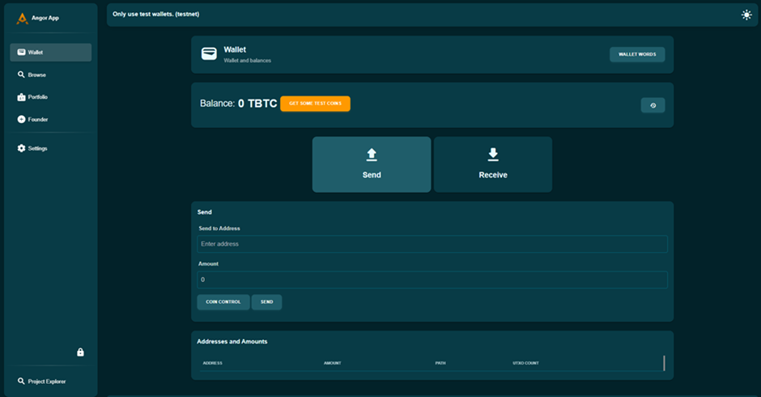
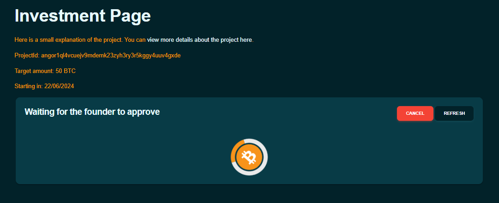
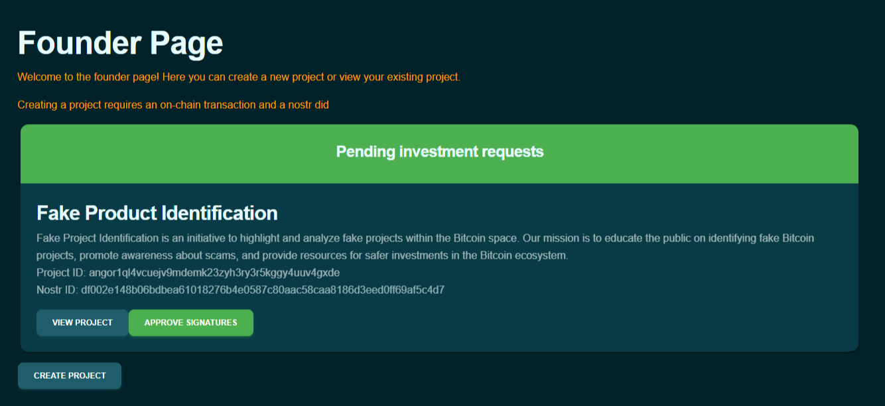
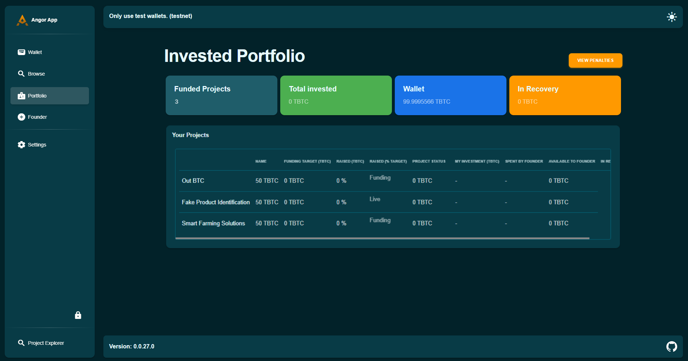

### الاستثمار في المشاريع بأمان مع Angor: دليل خطوة بخطوة

Angor هي منصة تمويل جماعي لامركزية مبنية على البيتكوين وتستخدم نوستر لتعزيز الأمان والشفافية. تتيح للمستثمرين الحفاظ على السيطرة على أموالهم وتدعم التواصل المباشر بين المستثمرين والمؤسسين. إليكم دليل خطوة بخطوة حول كيفية الاستثمار باستخدام Angor.

### كيفية الاستثمار باستخدام Angor: دليل خطوة بخطوة للمتابعة:

### تصفح المشاريع

لبدء الاستثمار، تحتاجون أولاً للعثور على مشروع يثير اهتمامكم.

- **زيارة منصة Angor**: ابدؤوا بالذهاب إلى موقع Angor. إذا لم تكن لديكم محفظة بعد، أنشئوا محفظة لاستخدام Angor؛ وإلا، استردوا محفظتكم.

- **الانتقال إلى قسم المشاريع**: انتقلوا إلى تبويب 'تصفح المشاريع' في القائمة الرئيسية. هذا سيأخذكم إلى القسم حيث جميع المشاريع المتاحة مدرجة.

    

- **استكشاف المشاريع**
1. **مراجعة التفاصيل**: كل إدراج مشروع يتضمن مجموعة متنوعة من التفاصيل مثل أهداف المشروع، الفريق خلفه، أهداف التمويل، والجداول الزمنية. اقضوا بعض الوقت في مراجعة هذه التفاصيل لفهم نطاق وهدف كل مشروع.

2. **تقييم الأهداف**: تحققوا من أهداف التمويل لرؤية كم يهدف المشروع لجمع الأموال. هذا سيعطيكم فكرة عن حجم المشروع واحتياجاته المالية. مشروع "حلول الزراعة الذكية" له مبلغ هدف قدره 50 TBTC.

3. **فهم الجداول الزمنية للمشاريع**: انظروا إلى الجداول الزمنية للمشاريع لرؤية المعالم والمواعيد النهائية المتوقعة. هذا يساعدكم في تقدير كم من الوقت سيكون استثماركم مقيداً ومتى يمكن توقع رؤية التقدم أو العوائد. على سبيل المثال، مراحل مشروع "حلول الزراعة الذكية" تشمل إنجاز 10% بحلول 30/04/2024، 30% بحلول 20/05/2024، و60% بحلول 30/05/2024.

    

أخذ الوقت لاستكشاف المشاريع بدقة سيساعدكم في اتخاذ قرار مدروس حول أين تستثمرون أموالكم.

### إنشاء محفظة

قبل أن تتمكنوا من الاستثمار في أي مشروع، تحتاجون لإعداد محفظة رقمية على Angor. إذا لم تكن لديكم محفظة بعد، أنشئوا محفظة لاستخدام Angor.

- **الانتقال إلى قسم المحفظة**: بمجرد تسجيل الدخول، ابحثوا عن قسم 'المحفظة' واضغطوا عليه من لوحة التحكم.

- **إنشاء محفظتكم**: اتبعوا التعليمات على الشاشة لإنشاء محفظتكم الرقمية. هذا عادة ما يتضمن:

    - التسجيل في منصة Angor.
    - الانتقال إلى قسم إنشاء المحفظة.
    - النقر على "إنشاء محفظة".
    - Angor ستقوم بإعداد المحفظة لكم تلقائياً.
    - وضع كلمة مرور قوية لحماية محفظتكم.

        

- **نسخ احتياطي لعبارات الاسترداد**: ستحصلون على مجموعة من عبارات الاسترداد. احتفظوا بها بأمان، لأنها ضرورية للوصول إلى محفظتكم إذا نسيتم كلمة المرور.

### كيفية الاستثمار في مشروع على Angor

**اختيار مشروع**

- **تصفح المشاريع المتاحة**: استكشفوا المشاريع المدرجة في Angor.
- **اختيار مشروع**: اختاروا مشروعاً يثير اهتمامكم.
- **مراجعة التفاصيل والمعالم**: اقرؤوا بعناية أهداف المشروع وأهداف التمويل والمعالم المتوقعة.

**تقديم استثمار**

- **الانتقال إلى صفحة المشروع**: اذهبوا إلى صفحة المشروع الذي اخترتموه.
- **النقر على "استثمار"**: ابحثوا عن زر "استثمار" واضغطوا عليه في صفحة المشروع.
- **إدخال مبلغ الاستثمار**: أدخلوا مبلغ البيتكوين الذي تريدون استثماره.
- **تقديم الاستثمار**: أكدوا المعاملة بالنقر على "تقديم".

    

- **انتظار الموافقة**: استثماركم يحتاج لموافقة من مؤسس المشروع. هذه عملية يدوية.

    

    

- **تأكيد المعاملة**: انتظروا تأكيد المعاملة على البلوك تشين، مما قد يستغرق بضع دقائق.

### استرداد الأموال مع غرامة

إذا كنتم تحتاجون لسحب استثماركم قبل اكتمال المشروع، يمكنكم فعل ذلك، لكن لاحظوا أنه ستكون هناك غرامة.

- **الانتقال إلى استثماراتكم**: من لوحة التحكم، اذهبوا إلى قسم 'الاستثمارات'.
- **اختيار المشروع**: اختاروا المشروع الذي تريدون سحب أموالكم منه.
- **طلب استرداد**: اضغطوا على خيار المطالبة باسترداد استثماركم واتبعوا الخطوات الموجهة.
- **فهم الغرامة**: كونوا على علم أن سحب استثماركم مبكراً سيتكبد غرامة، تُخصم من المبلغ المسترد. الشروط المحددة لهذه الغرامة ستكون مفصلة في معلومات المشروع.

    

### 1. بدء استرداد الأموال

- إذا فشل مشروع في تحقيق معالمه، اذهبوا إلى لوحة تحكم مشروعكم.
- اضغطوا على خيار الاسترداد.
- ابدؤوا عملية استرداد الأموال.

### 2. استلام الأموال المستردة في الغرامة

- أكدوا معاملة الاسترداد.
- تحققوا من أن أموالكم مقفلة في الغرامة (ستظهر كم يوماً متبقياً لاسترداد الأموال).

### 3. استلام الأموال خارج الغرامة

- انتظروا حتى تنتهي الغرامة.
- انقلوا أموالكم من الغرامة إلى محفظتكم.

باتباع هذه الخطوات، يمكنكم استخدام Angor بفعالية لاكتشاف مشاريع واعدة، واستثمار أموالكم، وإدارة استثماراتكم بكفاءة.

استثمار سعيد!