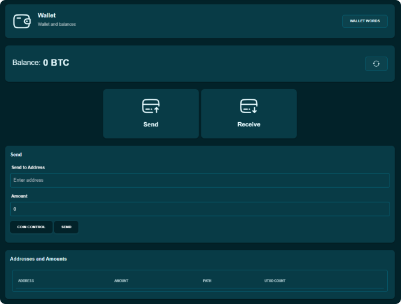
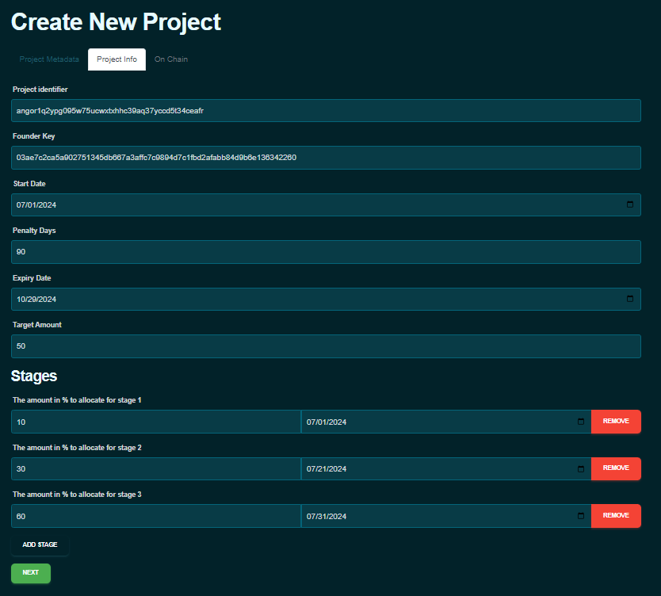
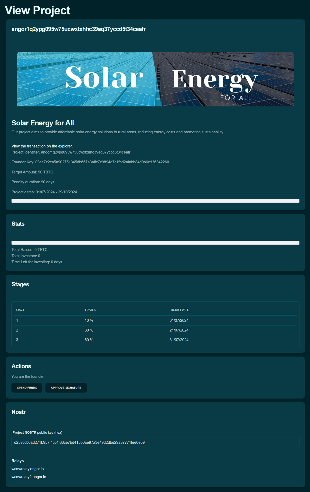
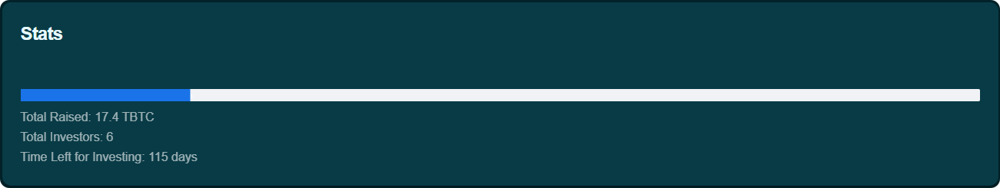

### جمع الأموال بأمان مع Angor: دليل خطوة بخطوة

Angor هي منصة تمويل جماعي لامركزية مبنية على البيتكوين وتستخدم نوستر لتعزيز الأمان والشفافية. تتيح للمؤسسين جمع الأموال لمشاريعهم مع الحفاظ على السيطرة على الأموال وتعزيز التواصل المباشر مع المستثمرين. إليكم دليل خطوة بخطوة حول كيفية جمع الأموال باستخدام Angor.

### إنشاء محفظة

قبل أن تتمكنوا من بدء جمع الأموال، تحتاجون لإعداد محفظة رقمية على Angor. إذا لم تكن لديكم محفظة بعد، أنشئوا محفظة لاستخدام Angor. اتبعوا التعليمات على الشاشة لإنشاء محفظتكم.

- انتقلوا إلى قسم إنشاء المحفظة.
- اضغطوا على "إنشاء محفظة".
- Angor ستقوم بإعداد المحفظة لكم تلقائياً.
- ضعوا كلمة مرور قوية لحماية محفظتكم.

- **نسخ احتياطي لعبارات الاسترداد**: ستحصلون على مجموعة من عبارات الاسترداد. احتفظوا بها بأمان، لأنها ضرورية للوصول إلى محفظتكم إذا نسيتم كلمة المرور.

  

### استرداد محفظة

إذا كان لديكم محفظة بالفعل وتحتاجون لاستردادها، اتبعوا هذه الخطوات:

- انتقلوا إلى قسم المحفظة.
- اضغطوا على "استرداد محفظة".
- أدخلوا تفاصيل الاسترداد: الصقوا كلمات محفظتكم في الحقل المخصص.
  اختيارياً، أدخلوا كلمة إضافية إذا استخدمتموها أثناء إنشاء محفظتكم.
- ضعوا كلمة مرور قوية لمحفظتكم المستردة.
- أكدوا النسخ الاحتياطي: تأكدوا من أنكم قد أخذتم نسخة احتياطية من كلمات محفظتكم وعبارة المرور بأمان.
  ضعوا علامة في المربع المؤكد أنكم أخذتم نسخة احتياطية من كلمات محفظتكم وعبارة المرور.
- أكملوا الاسترداد:
  اضغطوا على "إنشاء محفظة" لإكمال عملية الاسترداد. ستتم استعادة محفظتكم مع الأموال وتاريخ المعاملات سليماً.

  

### إنشاء مشروع

بمجرد إعداد محفظتكم، يمكنكم إنشاء مشروع لبدء جمع الأموال. إليكم الخطوات المتضمنة، موضحة بصور من واجهة منصة Angor.

### الخطوة 1: ملء البيانات الوصفية للمشروع

- **الانتقال إلى قسم "إنشاء مشروع"**: انتقلوا إلى قسم 'المؤسس' واضغطوا على 'إنشاء مشروع'.

- **إدخال البيانات الوصفية للمشروع**:
  - **اسم المشروع**: أدخلوا اسماً واضحاً ووصفياً لمشروعكم.
  - **حول**: قدموا معلومات مفصلة عن مشروعكم، بما في ذلك أهدافه ورؤيته.
  - **موقع المشروع**: أدخلوا رابط موقع مشروعكم، إن وُجد.
  - **البانر**: أدخلوا رابط صورة بانر مشروعكم لجعل صفحة مشروعكم جذابة بصرياً.
  - **Nip 05 و Nip 57 (الزابز)**: املؤوا هذه الحقول بالمعلومات ذات الصلة إن أمكن. الزابز هي تبرعات صغيرة اختيارية يمكن للداعمين تقديمها لمشروعكم. [تعلموا المزيد عن الزابز](https://bitcoiner.guide/zap/)
  - **الصورة**: أدخلوا رابط الصورة المرجعية لمشروعكم.

    

  - اضغطوا "التالي" للانتقال إلى الخطوة التالية.

### الخطوة 2: تقديم معلومات المشروع

- **إدخال معرف المشروع ومفتاح المؤسس**: هذه الحقول ستُولد تلقائياً بواسطة Angor.
- **تاريخ البداية وتاريخ الانتهاء**: حددوا تاريخ بداية مشروعكم وتاريخ انتهائه.
- **أيام الغرامة**: حددوا عدد أيام الغرامة.
- **المبلغ المستهدف**: حددوا إجمالي مبلغ التمويل الذي تهدفون لجمعه.
- **تحديد مراحل المشروع**:
  - خصصوا نسبة مئوية من إجمالي الأموال لكل مرحلة.
  - حددوا التاريخ لكل مرحلة.
  - اضغطوا "التالي" للانتقال إلى الخطوة التالية.

    

### الخطوة 3: التأكيد على السلسلة

- **مراجعة تفاصيل المشروع**: راجعوا جميع تفاصيل مشروعكم.
- **تأكيد إنشاء المشروع**: بمجرد التحقق من جميع المعلومات، اضغطوا على "تقديم" لإتمام إنشاء مشروعكم على البلوك تشين.

    

### الانتقال إلى القسم التالي
بعد ملء جميع المعلومات المطلوبة في قسم معلومات المشروع، اضغطوا على زر "التالي" للانتقال إلى قسم السلسلة، حيث ستحددون المعاملات المرتبطة بالبلوك تشين لمشروعكم.

### نشر تحديثات المشروع على نوستر

- صدروا المفتاح الخاص من Angor.
- استوردوا المفتاح الخاص إلى عميل نوستر.
- انشروا تحديثات حول تقدم المشروع وإنجاز المعالم على نوستر.
- تأكدوا من أن التحديثات واضحة ومفيدة للمستثمرين.

### الموافقة على طلبات الاستثمار
- بمجرد أن يصبح مشروعكم مباشراً على Angor، قد تبدؤون في تلقي طلبات استثمار من مستثمرين محتملين.
- مراجعة الطلبات: انتقلوا إلى قسم "الإجراءات" في لوحة تحكم مشروعكم لعرض جميع التوقيعات المعلقة.

  

- الموافقة على التوقيعات: وافقوا على الطلب من خلال Angor. هذا الإجراء يؤكد قبول مساهمة المستثمر في مشروعكم.

  

### إنفاق الأموال للمعالم

- كمؤسس، بمجرد الوصول لمعلم، وقعوا على المعاملة لإنفاق الأموال لذلك المعلم.
- تأكدوا من أن الإنفاق يتماشى مع متطلبات المعلم وأهداف المشروع.

  

### المطالبة بالأموال
راقبوا تقدم المشروع بسهولة، أطلقوا أموال المعالم، وتعاملوا مع الغرامات مباشرة من لوحة تحكم Angor.

#### 1. مراقبة تقدم المشروع

- تحققوا بانتظام من تحديثات المشروع على Angor.
- تأكدوا من أن المعالم يتم تحقيقها كما هو مخطط.

  

#### 2. بدء إطلاق الأموال للمعالم

- بمجرد الوصول لمعلم، انتقلوا إلى لوحة تحكم مشروعكم.
- ابحثوا عن المعلم الذي تم تحقيقه واضغطوا على زر "مطالبة بالأموال".
- وقعوا على المعاملة لإطلاق الأموال لذلك المعلم.

#### 3. عملية المطالبة المنتظمة بالأموال:

- انتقلوا إلى قسم "الأموال" في لوحة تحكم مشروعكم.
- اضغطوا على زر "مطالبة بالأموال" لأموال المعالم المتاحة.
- وقعوا على المعاملة لنقل الأموال إلى محفظتكم.

باتباع هذه الخطوات، يمكنكم استخدام Angor بفعالية لجمع الأموال لمشروعكم، مما يضمن عملية سلسة وشفافة من البداية إلى النهاية.