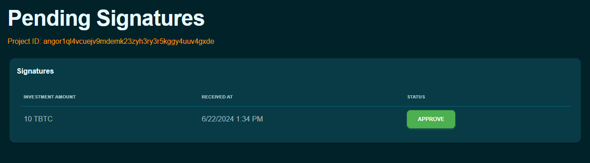

### سرمایه‌گذاری امن در پروژه‌ها با Angor: راهنمای گام به گام

Angor پلتفرم تأمین مالی جمعی غیرمتمرکز ساخته شده بر روی بیت‌کوین است و از Nostr برای امنیت و شفافیت بهبود یافته استفاده می‌کند. این پلتفرم به سرمایه‌گذاران اجازه می‌دهد کنترل وجوه خود را حفظ کنند و از ارتباط مستقیم بین سرمایه‌گذاران و بنیان‌گذاران پشتیبانی می‌کند. در اینجا راهنمای گام به گام نحوه سرمایه‌گذاری با استفاده از Angor ارائه شده است.

### چگونه با استفاده از Angor سرمایه‌گذاری کنیم: راهنمای گام به گام برای پیگیری:

### مرور پروژه‌ها

برای شروع سرمایه‌گذاری، ابتدا باید پروژه‌ای پیدا کنید که مورد علاقه شما باشد.

- **بازدید از پلتفرم Angor**: با رفتن به وب‌سایت Angor شروع کنید. اگر هنوز کیف پول ندارید، کیف پولی برای استفاده از Angor ایجاد کنید؛ در غیر این صورت، کیف پول خود را بازیابی کنید.

- **رفتن به بخش پروژه‌ها**: به تب 'مرور پروژه‌ها' در منوی اصلی بروید. این شما را به بخشی می‌برد که تمام پروژه‌های موجود فهرست شده‌اند.

    

- **کاوش پروژه‌ها**
1. **بررسی جزئیات**: هر فهرست پروژه شامل جزئیات مختلفی مانند اهداف پروژه، تیم پشت آن، اهداف تأمین مالی و جدول زمانی است. مدتی صرف بررسی این جزئیات کنید تا دامنه و هدف هر پروژه را درک کنید.

2. **ارزیابی اهداف**: اهداف تأمین مالی را بررسی کنید تا ببینید پروژه قصد جمع‌آوری چه مقداری را دارد. این به شما ایده‌ای از مقیاس پروژه و نیازهای مالی آن می‌دهد. پروژه "راه‌حل‌های کشاورزی هوشمند" مقدار هدف 50 TBTC دارد.
3. **درک جدول زمانی پروژه‌ها**: جدول زمانی پروژه‌ها را نگاه کنید تا نقاط عطف و مهلت‌های مورد انتظار را ببینید. این به شما کمک می‌کند تا بسنجید چقدر سرمایه‌گذاری شما گره خواهد خورد و چه زمانی می‌توانید انتظار پیشرفت یا بازدهی داشته باشید.  به عنوان مثال، مراحل پروژه "راه‌حل‌های کشاورزی هوشمند" شامل 10% تکمیل تا 30/04/2024، 30% تا 20/05/2024، و 60% تا 30/05/2024 است.

    
    

صرف زمان برای کاوش کامل پروژه‌ها به شما کمک می‌کند تصمیم آگاهانه‌ای درباره محل سرمایه‌گذاری وجوه خود بگیرید.

### ایجاد کیف پول

قبل از اینکه بتوانید در هر پروژه‌ای سرمایه‌گذاری کنید، باید کیف پول دیجیتال در Angor راه‌اندازی کنید. اگر هنوز کیف پول ندارید، کیف پولی برای استفاده از Angor ایجاد کنید.

- **رفتن به بخش کیف پول**: پس از ورود، بخش 'کیف پول' را از داشبورد خود پیدا کرده و روی آن کلیک کنید.

- **ایجاد کیف پول**: دستورالعمل‌های روی صفحه را برای ایجاد کیف پول دیجیتال دنبال کنید. این معمولاً شامل موارد زیر است:

    - در پلتفرم Angor ثبت‌نام کنید.
    - به بخش ایجاد کیف پول بروید.
    - روی "ایجاد کیف پول" کلیک کنید.
    - Angor به طور خودکار کیف پول را برای شما تنظیم می‌کند.
    - رمز عبور قوی برای محافظت از کیف پول تنظیم کنید.

        

- **پشتیبان‌گیری از عبارات بازیابی**: مجموعه‌ای از عبارات بازیابی به شما داده می‌شود. اینها را به طور امن ذخیره کنید، زیرا برای دسترسی به کیف پول در صورت فراموشی رمز عبور ضروری هستند.

### چگونه در پروژه‌ای در Angor سرمایه‌گذاری کنیم

**انتخاب پروژه**

- **مرور پروژه‌های موجود**: پروژه‌های فهرست شده در Angor را کاوش کنید.
- **انتخاب پروژه**: پروژه‌ای که مورد علاقه شما است انتخاب کنید.
- **بررسی جزئیات و نقاط عطف**: اهداف، هدف‌های تأمین مالی و نقاط عطف مورد انتظار پروژه را با دقت بخوانید.

**انجام سرمایه‌گذاری**

- **رفتن به صفحه پروژه**: به صفحه پروژه‌ای که انتخاب کرده‌اید بروید.
- **کلیک "سرمایه‌گذاری"**: دکمه "سرمایه‌گذاری" را در صفحه پروژه پیدا کرده و روی آن کلیک کنید.
- **وارد کردن مقدار سرمایه‌گذاری**: مقدار بیت‌کوینی که می‌خواهید سرمایه‌گذاری کنید را وارد کنید.
- **ارسال سرمایه‌گذاری**: تراکنش را با کلیک "ارسال" تأیید کنید.

    

- **انتظار برای تأیید**: سرمایه‌گذاری شما نیاز به تأیید توسط بنیان‌گذار پروژه دارد. این فرآیند دستی است.

    

    

- **تأیید تراکنش**: منتظر تأیید تراکنش در بلاک‌چین بمانید که ممکن است چند دقیقه طول بکشد.

### بازپس‌گیری وجوه با جریمه

اگر نیاز به برداشت سرمایه‌گذاری خود قبل از تکمیل پروژه دارید، می‌توانید این کار را انجام دهید، اما توجه داشته باشید که جریمه‌ای خواهد داشت.

- **رفتن به سرمایه‌گذاری‌های شما**: از داشبورد خود، به بخش 'سرمایه‌گذاری‌ها' بروید.
- **انتخاب پروژه**: پروژه‌ای که می‌خواهید وجوه خود را از آن برداشت کنید انتخاب کنید.
- **درخواست بازپرداخت**: روی گزینه بازپس‌گیری سرمایه‌گذاری کلیک کنید و مراحل راهنما را دنبال کنید.
- **درک جریمه**: آگاه باشید که برداشت زودهنگام سرمایه‌گذاری جریمه‌ای در پی دارد که از مقدار بازپرداختی کسر می‌شود. شرایط مشخص این جریمه در اطلاعات پروژه تشریح شده است.

    

### 1. شروع بازیابی وجوه

- اگر پروژه‌ای در رسیدن به نقاط عطف خود ناکام ماند، به داشبورد پروژه خود بروید.
- روی گزینه بازیابی کلیک کنید.
- فرآیند بازیابی وجوه را آغاز کنید.

### 2. دریافت وجوه بازیابی شده به جریمه

- تراکنش بازیابی را تأیید کنید.
- بررسی کنید که وجوه شما در جریمه قفل شده‌اند (نشان می‌دهد چند روز تا بازیابی وجوه باقی مانده).

### 3. دریافت وجوه از جریمه

- تا انقضای جریمه صبر کنید.
- وجوه خود را از جریمه به کیف پول منتقل کنید.

با دنبال کردن این مراحل، می‌توانید از Angor به طور مؤثر برای کشف پروژه‌های امیدوارکننده، سرمایه‌گذاری وجوه خود و مدیریت کارآمد سرمایه‌گذاری‌هایتان استفاده کنید.

سرمایه‌گذاری موفق!