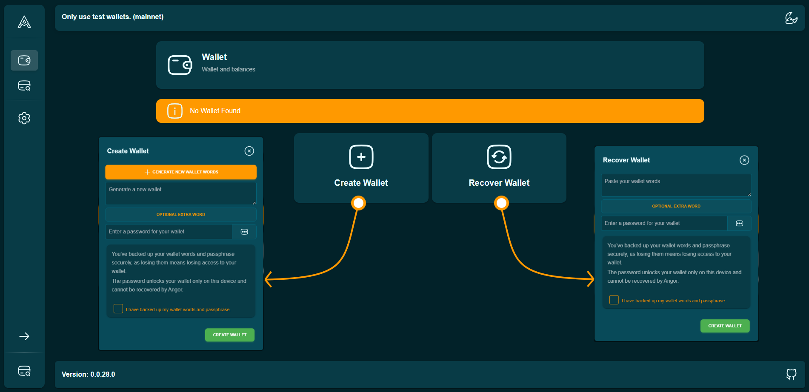
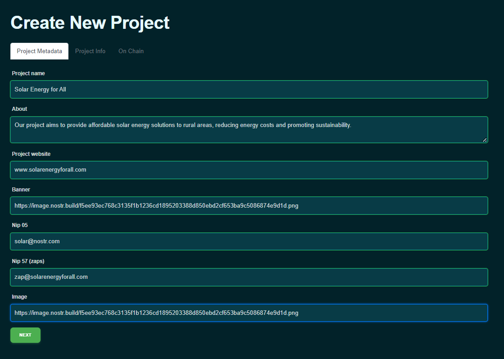
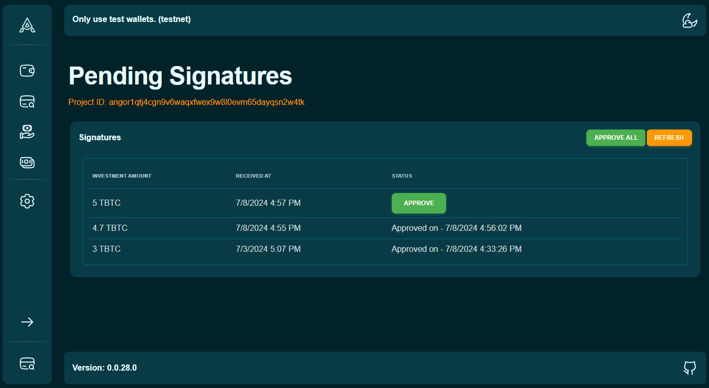

### جمع‌آوری وجه امن با Angor: راهنمای گام به گام

Angor پلتفرم تأمین مالی جمعی غیرمتمرکز ساخته شده بر روی بیت‌کوین است و از Nostr برای امنیت و شفافیت بهبود یافته استفاده می‌کند. این پلتفرم به بنیان‌گذاران اجازه می‌دهد برای پروژه‌های خود وجه جمع‌آوری کنند در حالی که کنترل وجوه را حفظ می‌کنند و ارتباط مستقیم با سرمایه‌گذاران را تقویت می‌کنند. در اینجا راهنمای گام به گام نحوه جمع‌آوری وجه با استفاده از Angor ارائه شده است.

### ایجاد کیف پول

قبل از اینکه بتوانید شروع به جمع‌آوری وجه کنید، باید کیف پول دیجیتال در Angor راه‌اندازی کنید. اگر هنوز کیف پول ندارید، کیف پولی برای استفاده از Angor ایجاد کنید. دستورالعمل‌های روی صفحه را برای ایجاد کیف پول دنبال کنید.

- به بخش ایجاد کیف پول بروید.
- روی "ایجاد کیف پول" کلیک کنید.
- Angor به طور خودکار کیف پول را برای شما تنظیم می‌کند.
- رمز عبور قوی تنظیم کنید تا از کیف پول خود محافظت کنید.

- **پشتیبان‌گیری از عبارات بازیابی**: مجموعه‌ای از عبارات بازیابی به شما داده می‌شود. اینها را به طور امن ذخیره کنید، زیرا برای دسترسی به کیف پول در صورت فراموشی رمز عبور ضروری هستند.

  

### بازیابی کیف پول

اگر از قبل کیف پول دارید و نیاز به بازیابی آن دارید، این مراحل را دنبال کنید:

- به بخش کیف پول بروید.
- روی "بازیابی کیف پول" کلیک کنید.
- جزئیات بازیابی را وارد کنید: کلمات کیف پول خود را در فیلد ارائه شده بچسبانید.
  در صورت تمایل، اگر در هنگام ایجاد کیف پول از کلمه اضافی استفاده کرده‌اید، آن را وارد کنید.
- رمز عبور قوی برای کیف پول بازیابی شده تنظیم کنید.
- تأیید پشتیبان: اطمینان حاصل کنید که کلمات کیف پول و عبارت رمز خود را به طور امن پشتیبان‌گیری کرده‌اید.
  جعبه تأیید اینکه کلمات کیف پول و عبارت رمز خود را پشتیبان‌گیری کرده‌اید را علامت بزنید.
- تکمیل بازیابی:
  روی "ایجاد کیف پول" کلیک کنید تا فرآیند بازیابی تکمیل شود. کیف پول شما با وجوه و تاریخچه تراکنش دست نخورده بازیابی خواهد شد.

  

### ایجاد پروژه

پس از راه‌اندازی کیف پول، می‌توانید پروژه‌ای برای شروع جمع‌آوری وجه ایجاد کنید. در اینجا مراحل درگیر به همراه تصاویر رابط پلتفرم Angor نشان داده شده است.

### قدم 1: پر کردن متادیتای پروژه

- **رفتن به بخش "ایجاد پروژه"**: به بخش 'بنیان‌گذار' بروید و روی 'ایجاد پروژه' کلیک کنید.

- **وارد کردن متادیتای پروژه**:
  - **نام پروژه**: نام واضح و توصیفی برای پروژه خود وارد کنید.
  - **درباره**: اطلاعات مفصلی درباره پروژه خود از جمله اهداف و چشم‌انداز آن ارائه دهید.
  - **وب‌سایت پروژه**: URL وب‌سایت پروژه خود را در صورت وجود وارد کنید.
  - **بنر**: URL تصویر بنر پروژه خود را وارد کنید تا صفحه پروژه از نظر بصری جذاب شود.
  - **Nip 05 و Nip 57 (zap ها)**: در صورت لزوم این فیلدها را با اطلاعات مربوطه پر کنید. Zap ها کمک‌های مالی کوچک و داوطلبانه هستند که حامیان می‌توانند به پروژه شما بدهند. [درباره zap بیشتر بدانید](https://bitcoiner.guide/zap/)
  - **تصویر**: URL تصویر مرجع پروژه خود را وارد کنید.

    

  - روی "بعدی" کلیک کنید تا به مرحله بعد بروید.

### قدم 2: ارائه اطلاعات پروژه

- **وارد کردن شناسه پروژه و کلید بنیان‌گذار**: این فیلدها به طور خودکار توسط Angor تولید می‌شوند.
- **تاریخ شروع و انقضا**: تاریخ شروع و انقضا برای پروژه خود تنظیم کنید.
- **روزهای جریمه**: تعداد روزهای جریمه را تعریف کنید.
- **مقدار هدف**: مقدار کل تأمین مالی که هدف جمع‌آوری آن را دارید مشخص کنید.
- **تعریف مراحل پروژه**:
  - درصدی از کل وجوه را به هر مرحله اختصاص دهید.
  - تاریخ هر مرحله را تنظیم کنید.
  - روی "بعدی" کلیک کنید تا به مرحله بعد بروید.

    

### قدم 3: تأیید روی زنجیره

- **بررسی جزئیات پروژه**: تمام جزئیات پروژه خود را بررسی کنید.
- **تأیید ایجاد پروژه**: پس از تأیید تمام اطلاعات، روی "ارسال" کلیک کنید تا ایجاد پروژه خود در بلاک‌چین نهایی شود.

    

### ادامه به بخش بعدی
پس از پر کردن تمام اطلاعات مورد نیاز در بخش اطلاعات پروژه، روی دکمه "بعدی" کلیک کنید تا به بخش روی زنجیره بروید، جایی که پارامترهای مربوط به بلاک‌چین برای پروژه خود تعریف خواهید کرد.

### انتشار به‌روزرسانی‌های پروژه در Nostr

- کلید خصوصی را از Angor صادر کنید.
- کلید خصوصی را به کلاینت Nostr وارد کنید.
- به‌روزرسانی‌هایی درباره پیشرفت پروژه و تکمیل نقاط عطف در Nostr منتشر کنید.
- اطمینان حاصل کنید که به‌روزرسانی‌ها واضح و آموزنده برای سرمایه‌گذاران باشند.

### تأیید درخواست‌های سرمایه‌گذاری
- پس از فعال شدن پروژه شما در Angor، ممکن است شروع به دریافت درخواست‌های سرمایه‌گذاری از سرمایه‌گذاران بالقوه کنید.
- بررسی درخواست‌ها: به بخش "عملیات" در داشبورد پروژه خود بروید تا تمام امضاهای در انتظار را مشاهده کنید.

  

- تأیید امضاها: درخواست را از طریق Angor تأیید کنید. این عمل تأیید پذیرش مشارکت سرمایه‌گذار در پروژه شما را نشان می‌دهد.

  

### خرج کردن وجوه برای نقاط عطف

- به عنوان بنیان‌گذار، زمانی که به نقطه عطف رسیدید، تراکنش را برای خرج کردن وجوه آن نقطه عطف امضا کنید.
- اطمینان حاصل کنید که خرج کردن با الزامات نقطه عطف و اهداف پروژه هم‌راستا باشد.

  

### درخواست وجوه 
به آسانی پیشرفت پروژه را نظارت کنید، وجوه نقاط عطف را آزاد کنید و جریمه‌ها را مستقیماً از داشبورد Angor خود مدیریت کنید.

#### 1. نظارت بر پیشرفت پروژه

- به طور منظم به‌روزرسانی‌های پروژه را در Angor بررسی کنید.
- اطمینان حاصل کنید که نقاط عطف همانطور که برنامه‌ریزی شده محقق می‌شوند.

  

#### 2. شروع آزادسازی وجوه برای نقاط عطف

- زمانی که به نقطه عطف رسیدید، به داشبورد پروژه خود بروید.
- نقطه عطف محقق شده را پیدا کنید و روی دکمه "درخواست وجوه" کلیک کنید.
- تراکنش را برای آزادسازی وجوه آن نقطه عطف امضا کنید.

#### 3. فرآیند معمول درخواست وجوه:

- به بخش "وجوه" در داشبورد پروژه خود بروید.
- روی دکمه "درخواست وجوه" برای وجوه نقطه عطف موجود کلیک کنید.
- تراکنش را برای انتقال وجوه به کیف پول خود امضا کنید.

با دنبال کردن این مراحل، می‌توانید به طور مؤثر از Angor برای جمع‌آوری وجه پروژه خود استفاده کنید و فرآیند روان و شفافی از شروع تا پایان تضمین کنید.