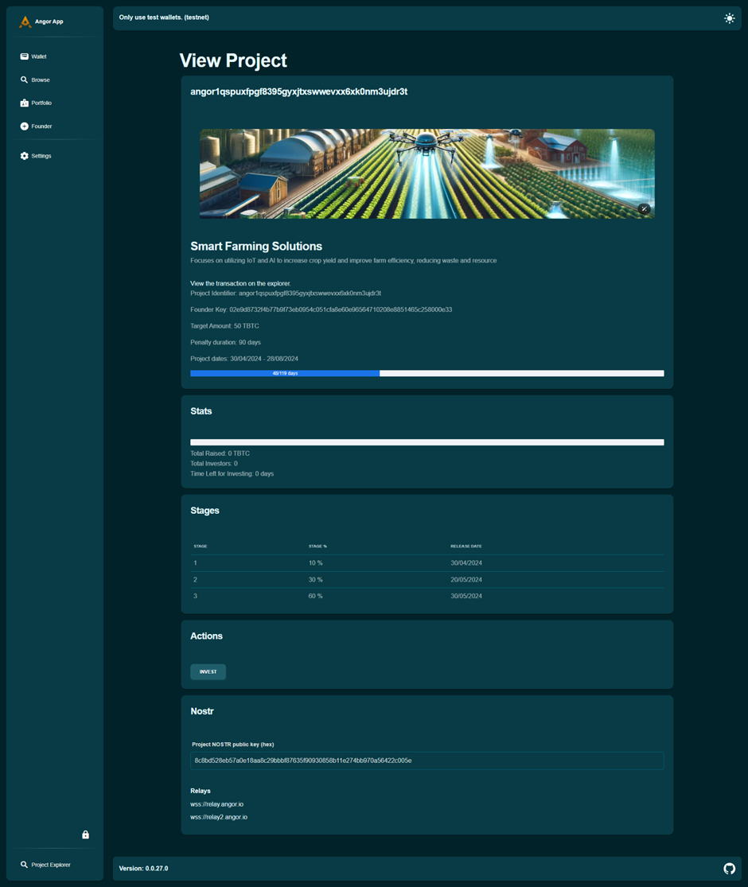

### Investir dans des Projets en Toute Sécurité avec Angor : Un Guide Étape par Étape

Angor est une plateforme de financement participatif décentralisée construite sur Bitcoin et utilise Nostr pour une sécurité et une transparence accrues. Elle permet aux investisseurs de maintenir le contrôle sur leurs fonds et soutient la communication directe entre investisseurs et fondateurs. Voici un guide étape par étape sur comment investir en utilisant Angor.

### Comment investir en utilisant Angor : Un guide étape par étape à suivre :

### Parcourir les Projets

Pour commencer à investir, vous devez d'abord trouver un projet qui vous intéresse.

- **Visitez la Plateforme Angor** : Commencez par aller sur le site web d'Angor. Si vous n'avez pas encore de portefeuille, créez un portefeuille pour utiliser Angor ; sinon, récupérez votre portefeuille.

- **Naviguez vers la Section Projets** : Naviguez vers l'onglet 'Parcourir les Projets' dans le menu principal. Cela vous amènera à la section où tous les projets disponibles sont listés.

    

- **Explorez les Projets**
1. **Examinez les Détails** : Chaque liste de projet inclut une variété de détails tels que les objectifs du projet, l'équipe derrière, ses objectifs de financement, et les échéanciers. Prenez du temps pour passer en revue ces détails pour comprendre la portée et le but de chaque projet.

2. **Évaluez les Objectifs** : Vérifiez les objectifs de financement pour voir combien le projet vise à lever. Cela vous donnera une idée de l'ampleur du projet et de ses besoins financiers. Le projet "Solutions d'Agriculture Intelligente" a un montant cible de 50 TBTC.
3. **Comprenez les Échéanciers des Projets** : Regardez les échéanciers du projet pour voir les jalons attendus et les échéances. Cela vous aide à évaluer combien de temps votre investissement sera immobilisé et quand vous pouvez espérer voir des progrès ou des retours.  Par exemple, les étapes du projet "Solutions d'Agriculture Intelligente" incluent 10% d'achèvement au 30/04/2024, 30% au 20/05/2024, et 60% au 30/05/2024.

    

Prendre le temps d'explorer minutieusement les projets vous aidera à prendre une décision éclairée sur où investir vos fonds.

### Créer un Portefeuille

Avant de pouvoir investir dans tout projet, vous devez configurer un portefeuille numérique sur Angor. Si vous n'avez pas encore de portefeuille, créez un portefeuille pour utiliser Angor.

- **Naviguez vers la Section Portefeuille** : Une fois connecté, trouvez et cliquez sur la section 'Portefeuille' depuis votre tableau de bord.

- **Créez Votre Portefeuille** : Suivez les instructions à l'écran pour créer votre portefeuille numérique. Cela implique généralement :

    - Inscrivez-vous sur la plateforme Angor.
    - Naviguez vers la section de création de portefeuille.
    - Cliquez sur "Créer un Portefeuille."
    - Angor configurera automatiquement le portefeuille pour vous.
    - Définissez un mot de passe fort pour protéger votre portefeuille.

        

- **Sauvegardez les Phrases de Récupération** : Vous recevrez un ensemble de phrases de récupération. Stockez-les en sécurité, car elles sont essentielles pour accéder à votre portefeuille si vous oubliez votre mot de passe.

### Comment Investir dans un Projet sur Angor

**Choisir un Projet**

- **Parcourez les Projets Disponibles** : Explorez les projets listés sur Angor.
- **Sélectionnez un Projet** : Choisissez un projet qui vous intéresse.
- **Examinez les Détails et les Jalons** : Lisez attentivement les objectifs du projet, les objectifs de financement, et les jalons attendus.

**Faire un Investissement**

- **Naviguez vers la Page du Projet** : Allez à la page du projet que vous avez sélectionné.
- **Cliquez sur "Investir"** : Localisez et cliquez sur le bouton "Investir" sur la page du projet.
- **Entrez le Montant d'Investissement** : Saisissez le montant de Bitcoin que vous souhaitez investir.
- **Soumettez l'Investissement** : Confirmez la transaction en cliquant sur "Soumettre."

    

- **Attendez l'Approbation** : Votre investissement doit être approuvé par le fondateur du projet. C'est un processus manuel.

    

    

- **Confirmation de Transaction** : Attendez que la transaction soit confirmée sur la blockchain, ce qui peut prendre quelques minutes.

### Récupérer les Fonds avec une Pénalité

Si vous devez retirer votre investissement avant que le projet soit terminé, vous pouvez le faire, mais notez qu'il y aura une pénalité.

- **Naviguez vers Vos Investissements** : Depuis votre tableau de bord, allez à la section 'Investissements'.
- **Sélectionnez le Projet** : Choisissez le projet duquel vous voulez retirer vos fonds.
- **Demandez un Remboursement** : Cliquez sur l'option pour récupérer votre investissement et suivez les étapes guidées.
- **Comprenez la Pénalité** : Soyez conscient que retirer votre investissement tôt entraînera une pénalité, déduite du montant remboursé. Les termes spécifiques de cette pénalité seront détaillés dans les informations du projet.

    

### 1. Initier la Récupération des Fonds

- Si un projet ne parvient pas à atteindre ses jalons, allez sur votre tableau de bord de projet.
- Cliquez sur l'option de récupération.
- Initiez le processus de récupération des fonds.

### 2. Recevoir des Fonds Récupérés dans la Pénalité

- Confirmez la transaction de récupération.
- Vérifiez que vos fonds sont bloqués dans la pénalité (il sera indiqué combien de jours restent pour récupérer les fonds).

### 3. Recevoir des Fonds Hors de la Pénalité

- Attendez l'expiration de la pénalité.
- Déplacez vos fonds hors de la pénalité vers votre portefeuille.

En suivant ces étapes, vous pouvez efficacement utiliser Angor pour découvrir des projets prometteurs, investir vos fonds, et gérer vos investissements efficacement.

Bon investissement !