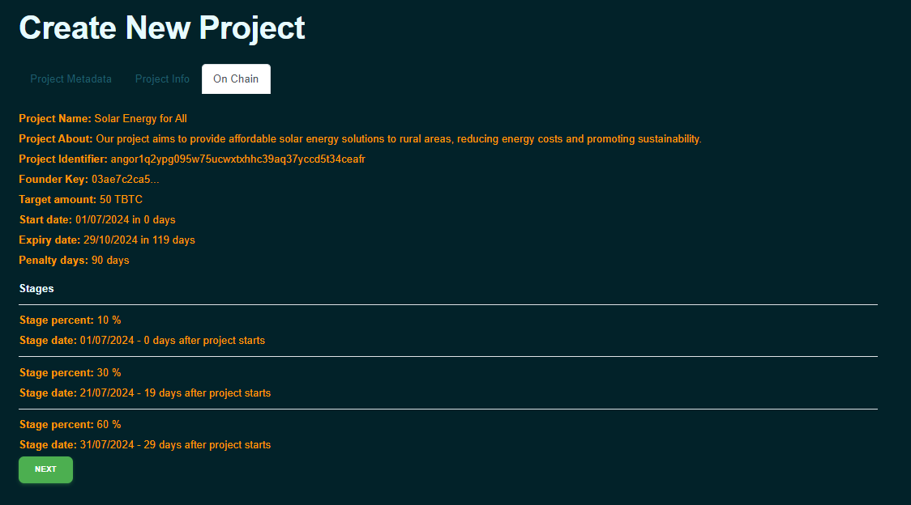
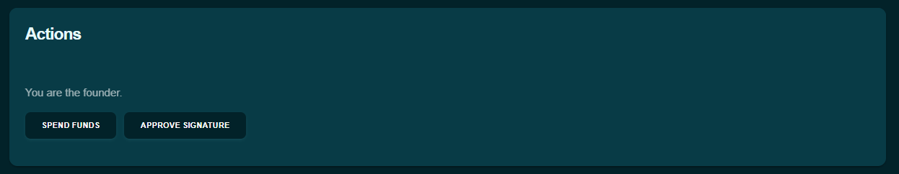
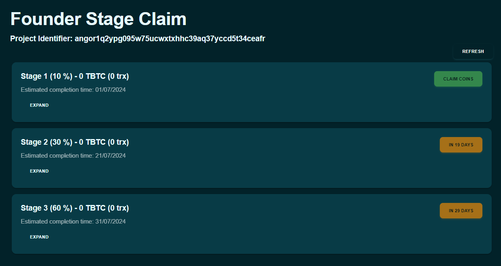

### Lever des Fonds en Toute Sécurité avec Angor : Guide Étape par Étape

Angor est une plateforme de financement participatif décentralisée construite sur Bitcoin et utilise Nostr pour une sécurité et une transparence accrues. Elle permet aux fondateurs de lever des fonds pour leurs projets tout en maintenant le contrôle sur les fonds et en favorisant la communication directe avec les investisseurs. Voici un guide étape par étape sur comment lever des fonds en utilisant Angor.

### Créer un Portefeuille

Avant de pouvoir commencer à lever des fonds, vous devez configurer un portefeuille numérique sur Angor. Si vous n'avez pas encore de portefeuille, créez un portefeuille pour utiliser Angor. Suivez les instructions à l'écran pour créer votre portefeuille.

- Naviguez vers la section de création de portefeuille.
- Cliquez sur "Créer un Portefeuille."
- Angor configurera automatiquement le portefeuille pour vous.
- Définissez un mot de passe fort pour protéger votre portefeuille.

- **Sauvegarder les Phrases de Récupération** : Vous recevrez un ensemble de phrases de récupération. Stockez-les en sécurité, car elles sont essentielles pour accéder à votre portefeuille si vous oubliez votre mot de passe.

  

### Récupérer un Portefeuille

Si vous avez déjà un portefeuille et devez le récupérer, suivez ces étapes :

- Naviguez vers la Section Portefeuille.
- Cliquez sur "Récupérer le Portefeuille."
- Entrez les Détails de Récupération : Collez vos mots de portefeuille dans le champ fourni.
  Optionnellement, entrez un mot supplémentaire si vous en avez utilisé un lors de la création de votre portefeuille.
- Définissez un mot de passe fort pour votre portefeuille récupéré.
- Confirmer la Sauvegarde : Assurez-vous d'avoir sauvegardé vos mots de portefeuille et votre phrase secrète en sécurité.
  Cochez la case confirmant que vous avez sauvegardé vos mots de portefeuille et votre phrase secrète.
- Compléter la Récupération :
  Cliquez sur "Créer un Portefeuille" pour compléter le processus de récupération. Votre portefeuille sera restauré avec les fonds et l'historique des transactions intacts.

  

### Créer un Projet

Une fois votre portefeuille configuré, vous pouvez créer un projet pour commencer à lever des fonds. Voici les étapes impliquées, illustrées avec des images de l'interface de la plateforme Angor.

### Étape 1 : Remplir les Métadonnées du Projet

- **Naviguez vers la Section "Créer un Projet"** : Naviguez vers la section 'Fondateur' et cliquez sur 'Créer un Projet'.

- **Entrez les Métadonnées du Projet** :
  - **Nom du Projet** : Entrez un nom clair et descriptif pour votre projet.
  - **À Propos** : Fournissez des informations détaillées sur votre projet, incluant ses objectifs et sa vision.
  - **Site Web du Projet** : Entrez l'URL du site web de votre projet, si disponible.
  - **Bannière** : Entrez l'URL de l'image de bannière de votre projet pour rendre votre page de projet visuellement attrayante.
  - **Nip 05 et Nip 57 (zaps)** : Remplissez ces champs avec les informations pertinentes si applicable. Les zaps sont de petits dons volontaires que les supporters peuvent donner à votre projet. [En savoir plus sur les zaps](https://bitcoiner.guide/zap/)
  - **Image** : Entrez l'URL de l'image de référence de votre projet.

    

  - Cliquez sur "Suivant" pour passer à l'étape suivante.

### Étape 2 : Fournir les Informations du Projet

- **Entrez l'Identifiant du Projet et la Clé du Fondateur** : Ces champs seront auto-générés par Angor.
- **Date de Début et Date d'Expiration** : Définissez la date de début et la date d'expiration pour votre projet.
- **Jours de Pénalité** : Définissez le nombre de jours de pénalité.
- **Montant Cible** : Spécifiez le montant total de financement que vous visez à lever.
- **Définir les Étapes du Projet** :
  - Allouez un pourcentage du total des fonds à chaque étape.
  - Définissez la date pour chaque étape.
  - Cliquez sur "Suivant" pour passer à l'étape suivante.

    

### Étape 3 : Confirmation On-Chain

- **Examinez les Détails du Projet** : Examinez tous les détails de votre projet.
- **Confirmez la Création du Projet** : Une fois toutes les informations vérifiées, cliquez sur "Soumettre" pour finaliser la création de votre projet sur la blockchain.

    

### Passer à la Section Suivante
Après avoir rempli toutes les informations requises dans la section Informations du Projet, cliquez sur le bouton "Suivant" pour passer à la section On Chain, où vous définirez les paramètres liés à la blockchain pour votre projet.

### Publier des Mises à Jour du Projet sur Nostr

- Exportez la clé privée depuis Angor.
- Importez la clé privée dans un client Nostr.
- Publiez des mises à jour sur les progrès du projet et l'achèvement des jalons sur Nostr.
- Assurez-vous que les mises à jour sont claires et informatives pour les investisseurs.

### Approuver les Demandes d'Investissement
- Une fois votre projet en ligne sur Angor, vous pouvez commencer à recevoir des demandes d'investissement de la part d'investisseurs potentiels.
- Examinez les Demandes : Naviguez vers la section "Actions" dans votre tableau de bord de projet pour voir toutes les signatures en attente.

  

- Approuvez les Signatures : Approuvez la demande via Angor. Cette action confirme l'acceptation de la contribution de l'investisseur à votre projet.

  

### Dépenser les Fonds pour les Jalons

- En tant que fondateur, une fois qu'un jalon est atteint, signez la transaction pour dépenser les fonds pour ce jalon.
- Assurez-vous que la dépense s'aligne avec les exigences du jalon et les objectifs du projet.

  

### Réclamer les Fonds 
Surveillez facilement les progrès du projet, libérez les fonds des jalons, et gérez les pénalités directement depuis votre tableau de bord Angor.

#### 1. Surveiller les Progrès du Projet

- Vérifiez régulièrement les mises à jour du projet sur Angor.
- Assurez-vous que les jalons sont atteints comme prévu.

  

#### 2. Initier la Libération des Fonds pour les Jalons

- Une fois qu'un jalon est atteint, naviguez vers votre tableau de bord de projet.
- Trouvez le jalon qui a été accompli et cliquez sur le bouton "Réclamer les Fonds".
- Signez la transaction pour libérer les fonds pour ce jalon.

#### 3. Processus Régulier de Réclamation des Fonds :

- Naviguez vers la section "Fonds" dans votre tableau de bord de projet.
- Cliquez sur le bouton "Réclamer les Fonds" pour les fonds de jalons disponibles.
- Signez la transaction pour transférer les fonds vers votre portefeuille.

En suivant ces étapes, vous pouvez efficacement utiliser Angor pour lever des fonds pour votre projet, assurant un processus fluide et transparent du début à la fin.