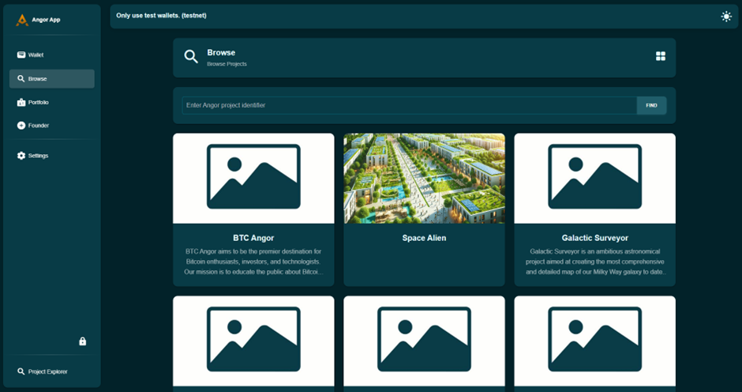
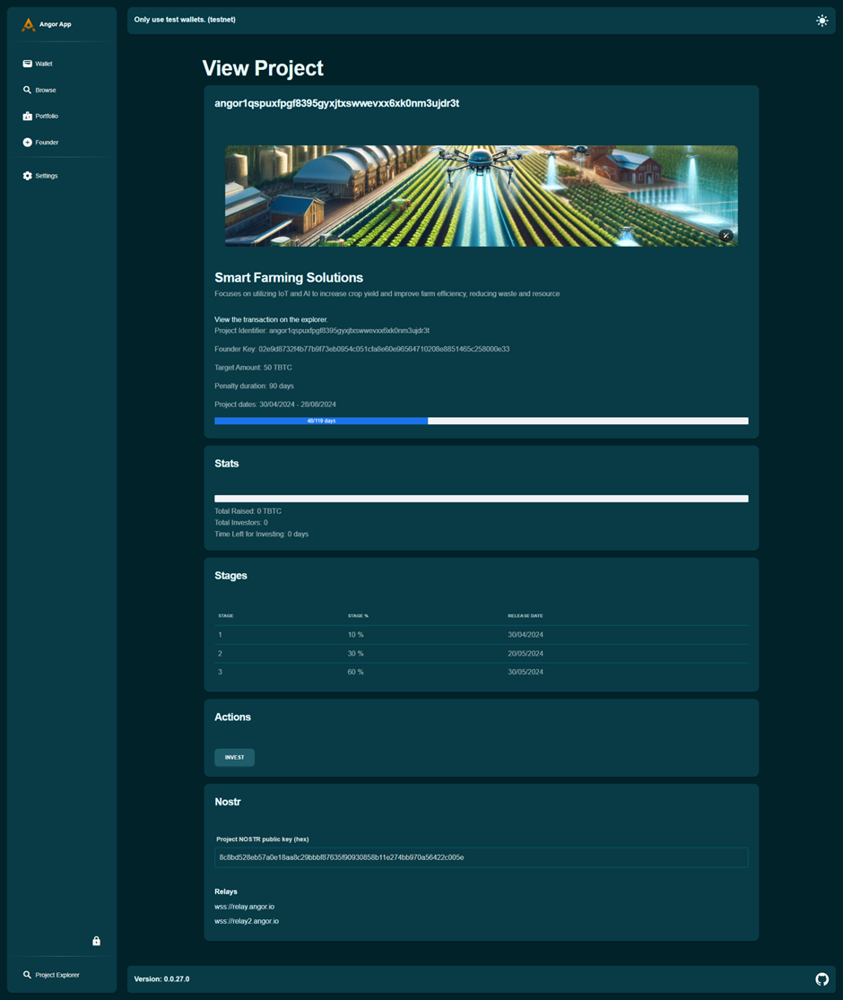
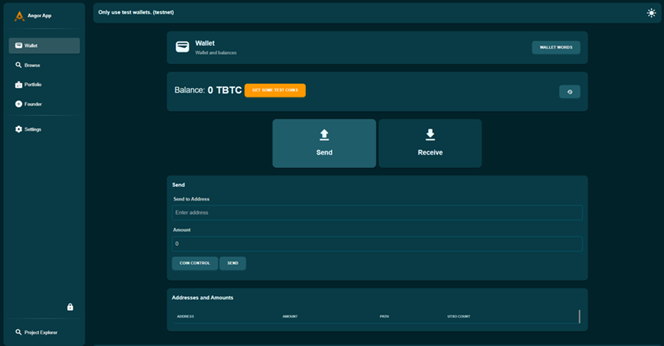
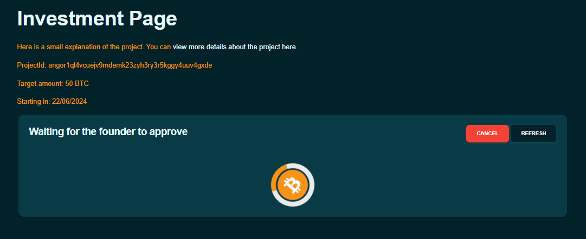
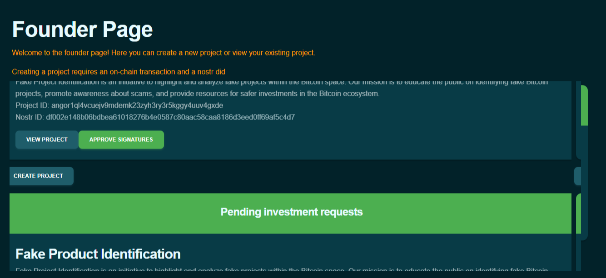
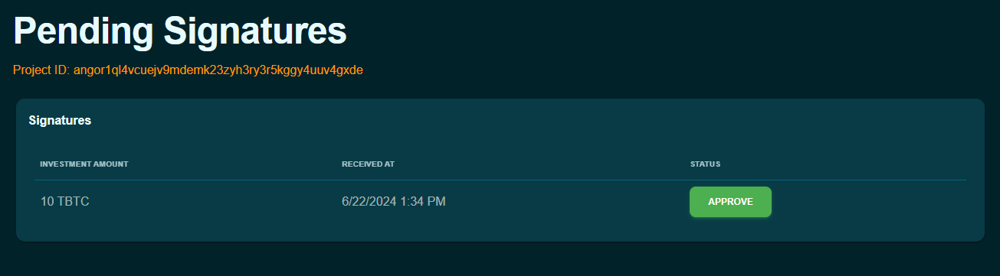
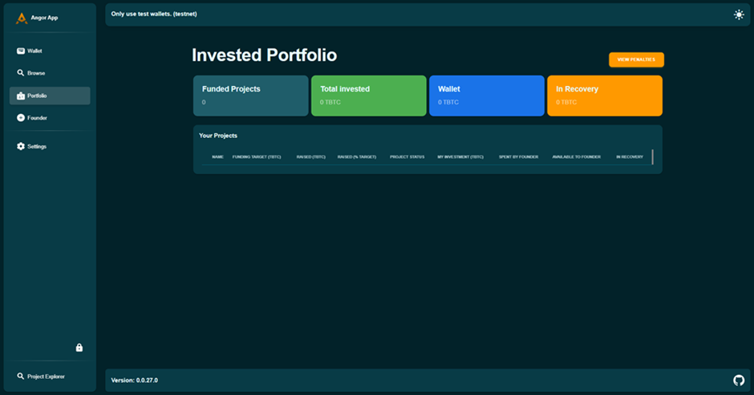

### Invest in Projects Securely with Angor: A Step-by-Step Guide

Angor is a decentralized crowdfunding platform built on Bitcoin and uses Nostr for enhanced security and transparency. It allows investors to maintain control over their funds and supports direct communication between investors and founders. Here’s a step-by-step guide on how to invest using Angor.

### How to invest using Angor: A Step-by-step guide to follow along:

### Browse for Projects

To begin investing, you first need to find a project that interests you.

- **Visit the Angor Platform**: Start by going to the Angor website. If you don’t have a wallet yet, create a wallet to use Angor; otherwise, recover your wallet.

- **Navigate to the Projects Section**: Navigate to the 'Projects Browse' tab in the main menu. This will take you to the section where all available projects are listed.

    

- **Explore the Projects**
1. **Review Details**: Each project listing includes a variety of details such as the project’s objectives, the team behind it, its funding goals, and timelines. Spend some time going through these details to understand the scope and purpose of each project.

2. **Assess Goals**: Check the funding goals to see how much the project aims to raise. This will give you an idea of the scale of the project and its financial needs. The "Smart Farming Solutions" project has a target amount of 50 TBTC.
3. **Understand Projects Timelines**: Look at the project timelines to see the expected milestones and deadlines. This helps you gauge how long your investment will be tied up and when you can expect to see progress or returns.  For instance, the stages of the "Smart Farming Solutions" project include 10% completion by 30/04/2024, 30% by 20/05/2024, and 60% by 30/05/2024.

    
    

Taking the time to thoroughly explore the projects will help you make an informed decision about where to invest your funds.

### Create a Wallet

Before you can invest in any project, you need to set up a digital wallet on Angor. If you don’t have a wallet yet, create a wallet to use Angor.

- **Navigate to the Wallet Section**: Once logged in, find and click on the 'Wallet' section from your dashboard.

- **Create Your Wallet**: Follow the on-screen instructions to create your digital wallet. This typically involves:

    - Sign up on the Angor platform.
    - Navigate to the wallet creation section.
    - Click on "Create Wallet."
    - Angor will automatically set up the wallet for you.
    - Set a strong password to protect your wallet.

        

- **Back Up Recovery Phrases**: You’ll be given a set of recovery phrases. Store these securely, as they are essential for accessing your wallet if you forget your password.

### How to Invest in a Project on Angor

**Choose a Project**

- **Browse Available Projects**: Explore the projects listed on Angor.
- **Select a Project**: Choose a project that interests you.
- **Review Details and Milestones**: Carefully read through the project’s objectives, funding goals, and expected milestones.

**Make an Investment**

- **Navigate to Project Page**: Go to the page of the project you selected.
- **Click "Invest"**: Locate and click the "Invest" button on the project page.
- **Enter Investment Amount**: Input the amount of Bitcoin you wish to invest.
- **Submit the Investment**: Confirm the transaction by clicking "Submit."

    

- **Wait for Approval**: Your investment needs to be approved by the project founder. This is a manual process.

    

    

- **Transaction Confirmation**: Wait for the transaction to be confirmed on the blockchain, which may take a few minutes.

### Claim Back Funds with a Penalty

If you need to withdraw your investment before the project is completed, you can do so, but note that there will be a penalty.

- **Navigate to Your Investments**: From your dashboard, go to the 'Investments' section.
- **Select the Project**: Choose the project from which you want to withdraw your funds.
- **Request a Refund**: Click on the option to claim back your investment and follow the guided steps.
- **Understand the Penalty**: Be aware that withdrawing your investment early will incur a penalty, deducted from the refunded amount. The specific terms of this penalty will be detailed in the project’s information.

    

### 1. Initiate Fund Recovery

- If a project fails to meet its milestones, go to your project dashboard.
- Click on the recovery option.
- Initiate the fund recovery process.

### 2. Receive Recovered Funds into Penalty

- Confirm the recovery transaction.
- Check your funds are locked in the penalty (it will show how many days are left to recover the funds).

### 3. Receive Funds out of Penalty

- Wait till the penalty expires.
- Move your funds out of penalty to your wallet.

By following these steps, you can effectively use Angor to discover promising projects, invest your funds, and manage your investments efficiently.

Happy investing!