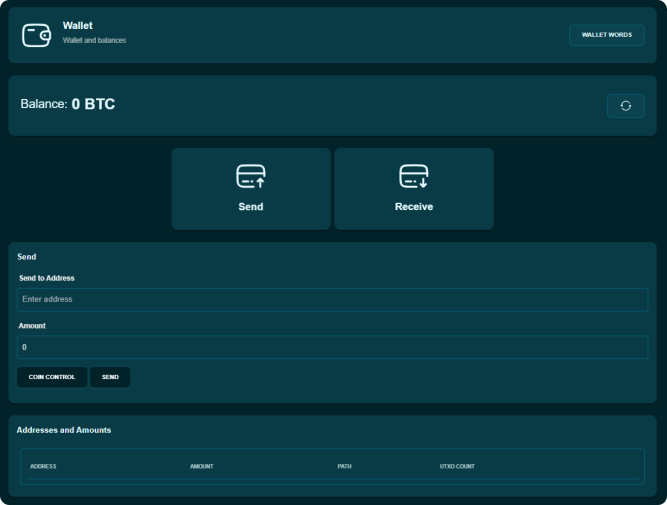
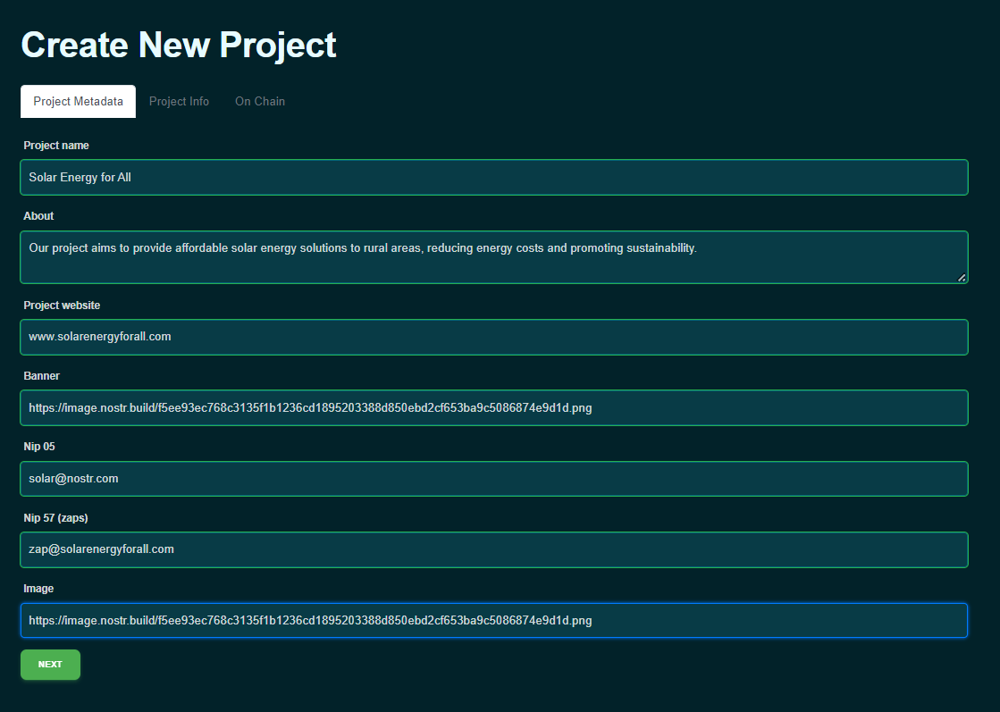
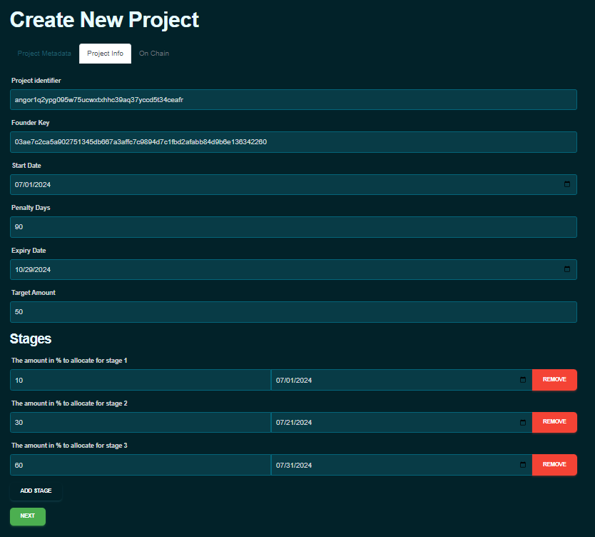
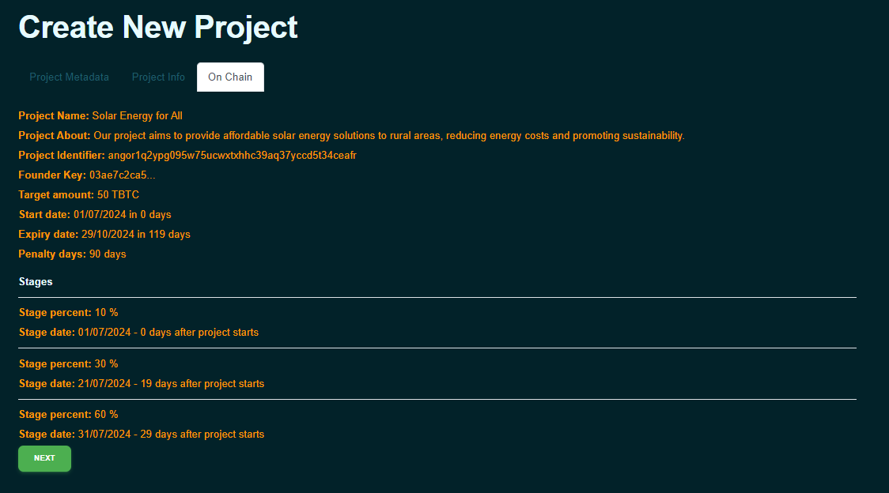
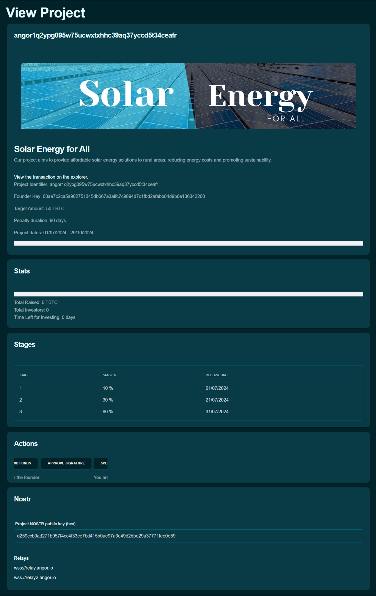
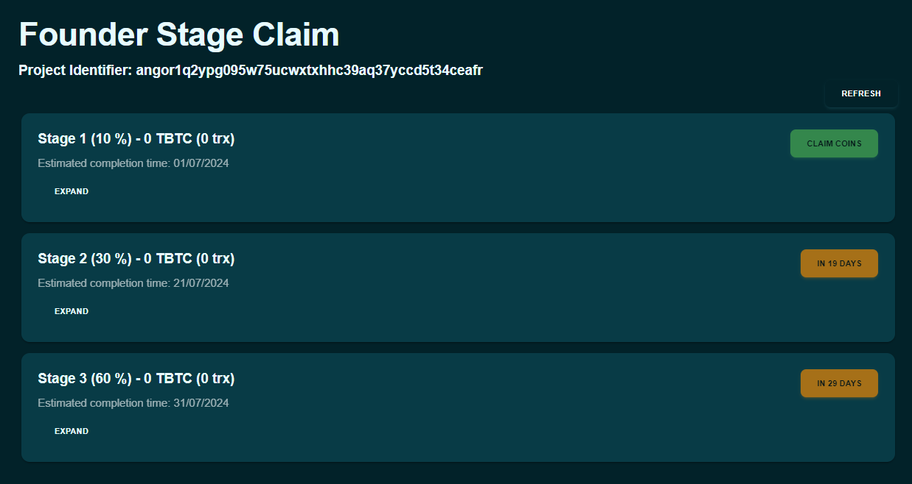
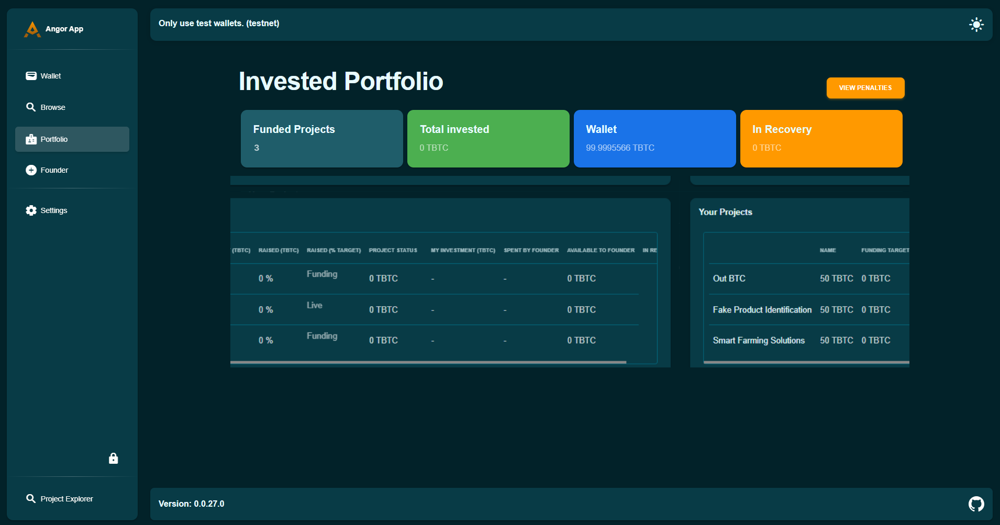

### Raise Funds Securely with Angor:  Step-by-Step Guide

Angor is a decentralized crowdfunding platform built on Bitcoin and uses Nostr for enhanced security and transparency. It allows founders to raise funds for their projects while maintaining control over the funds and fostering direct communication with investors. Here’s a step-by-step guide on how to raise funds using Angor.

### Create a Wallet

Before you can start raising funds, you need to set up a digital wallet on Angor. If you don’t have a wallet yet, create a wallet to use Angor. Follow the on-screen instructions to create your wallet.
- Navigate to the wallet creation section.
- Click on "Create Wallet."
- Angor will automatically set up the wallet for you.
- Set a strong password to protect your wallet.

  

- **Back Up Recovery Phrases**: You’ll be given a set of recovery phrases. Store these securely, as they are essential for accessing your wallet if you forget your password.

### Create a Project

Once your wallet is set up, you can create a project to start raising funds. Here are the steps involved, illustrated with images of the Angor platform interface.

### Step 1: Fill in Project Metadata

- **Navigate to the "Create Project" Section**: Navigate to the 'Founder' section and click on 'Create Project'.

- **Enter Project Metadata**:
  - **Project Name**: Enter a clear and descriptive name for your project.
  - **About**: Provide detailed information about your project, including its objectives and vision.
  - **Project Website**: Enter the URL of your project’s website, if available.
  - **Banner**: Enter the URL of your project’s banner image to make your project page visually appealing.
  - **Nip 05 and Nip 57 (zaps)**: Fill these fields with the relevant information if applicable. Zaps are small, voluntary donations that supporters can give to your project. [Learn more about zaps](https://bitcoiner.guide/zap/)
  - **Image**: Enter the URL of your project’s reference image.

    

  - Click "Next" to proceed to the next step.

### Step 2: Provide Project Info

- **Enter Project Identifier and Founder Key**: These fields will be auto-generated by Angor.
- **Start Date and Expiry Date**: Set the start date and the expiry date for your project.
- **Penalty Days**: Define the number of penalty days.
- **Target Amount**: Specify the total amount of funding you aim to raise.
- **Define Project Stages**:
  - Allocate a percentage of the total funds to each stage.
  - Set the date for each stage.
  - Click "Next" to proceed to the next step.

    

### Step 3: On-Chain Confirmation

- **Review Project Details**: Review all the details of your project.
- **Confirm Project Creation**: Once all the information is verified, click on "Submit" to finalize the creation of your project on the blockchain.

    

### Proceeding to the Next Section
After filling out all the required information in the Project Info section, click the "Next" button to move on to the On Chain section, where you will define blockchain-related parameters for your project.

### Post Project Updates on Nostr

- Export the private key from Angor.
- Import the private key into a Nostr client.
- Post updates on project progress and milestone completion on Nostr.
- Ensure updates are clear and informative for investors.

### Spend Funds for Milestones

- As a founder, once a milestone is reached, sign the transaction to spend the funds for that milestone.
- Ensure the spending aligns with the milestone requirements and project goals.

  

### Claiming Funds 
Easily monitor project progress, release milestone funds, and handle penalties directly from your Angor dashboard.

#### 1. Monitor Project Progress

- Regularly check the project updates on Angor.
- Ensure that the milestones are being met as planned.

#### 2. Initiate Fund Release for Milestones

- Once a milestone is reached, navigate to your project dashboard.
- Find the milestone that has been achieved and click on the "Claim Funds" button.
- Sign the transaction to release the funds for that milestone.

#### 3. Regular Fund Claim Process:

- Navigate to the "Funds" section in your project dashboard.
- Click on the "Claim Funds" button for the available milestone funds.
- Sign the transaction to transfer the funds to your wallet.
  
  

By following these steps, you can effectively use Angor to raise funds for your project, ensuring a smooth and transparent process from start to finish.